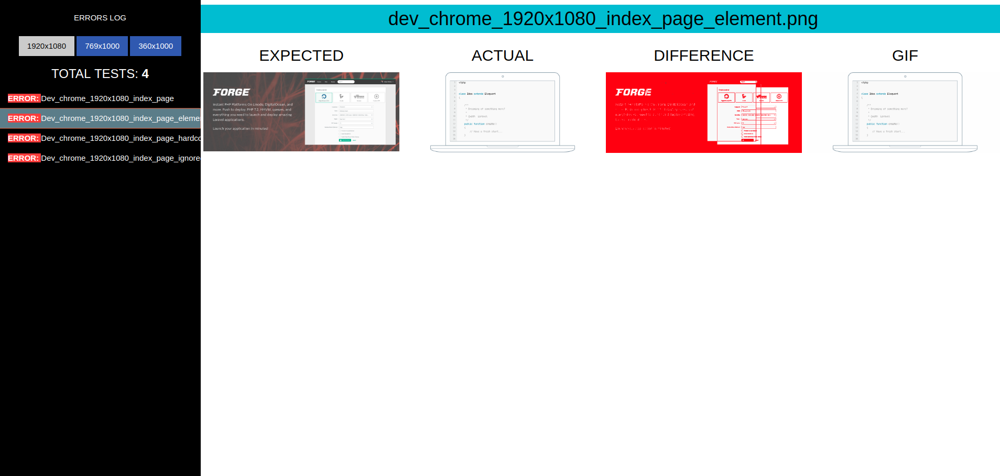

# Visual regression boilerplate project

- Java 
- TestNG
- Selenium Webdriver 
- aShot

### How to start using this project

##### 1 - Installation

1. Install java
2. Install maven 
3. Install browsers
    1. chrome
    2. firefox

##### 2 - Explore `DriverWrapper` class constructor method

`DriverWrapper` creates `WebDriver` and has some helpers methods.  
WebDriver is created in `DriverWrapper` class constructor. 
You may add new browsers here.

##### 3 - Set project settings in `TestConfig` class

Project settings are located in `TestConfig` class.  
You can pass command line arguments when starting tests.   
For example `mvn test -Dbrowser=chrome`, where `-Dbrowser=chrome` = `TestConfig.browser`  
Command line parameters are extracted in `TestConfig.initConfig()` method. 

##### 4 - Set URL for site you're going to test
 
`BasePage` is a base class for all page objects. All page object classes must extend `BasePage` class.  
You can set URL for test site in `BasePage.setBaseUrl()` method.  
It's not necessary to use `BasePage` or `App`. It's just an example. 

##### 5 - Explore `TestExample` class and create your own tests

- All test classes must extend `BaseTest` class. 

##### 6 - Add new tests in `testng.xml` file

### Screenshots comparison

Before start you should set `allowableDiffSize`.  
It is allowable difference size (number of different pixels) between two screenshots.  
Test will not fail if difference between 2 screenshots is less than `allowableDiffSize`.

- The variable is located in `TestConfig` class.
- By default `allowableDiffSize == 10`.

**Compare page screenshots**

- `comparePageScreenshots("index_page");`

**Compare page screenshots and ignore specified elements(only css selectors are allowed)**

- ignore one element - `comparePageScreenshots("index_page_ignored_element", "div.macbook");`
- ignore many elements - `comparePageScreenshots("index_page_ignored_elements", new String[]{"section.panel.features.dark", "div.macbook"});`

**Compare element screenshots**

- use css selector - `compareElementScreenshots("index_page_element", "a.full.forge");`
- or pass WebElement object - `compareElementScreenshots("index_page_element", driver.findElement(By.cssSelector("a.full.forge")));`

----

### Project structure

**app:**

Page object pattern example. 

- `App` - main application / site class. It contains all page objects.
- `BasePage` - all page objects must extend this class.
- `IndexPage` - page object for index page.

**tools:**

- `TestConfig` - project settings(browser, env, etc..), paths to screenshots and other settings are located here. 
- `DriverWrapper` - wrapper for Selenium WebDriver with some helpers methods. 
- `Screenshoter` - creates and saves actual and expected screenshots.
- `DiffImageGenerator` - generates diff images. Difference is highlighted with red color.
- `GifGenerator` - gif images generator. Generates gif file from actual, expected and diff image.
- `ReportGenerator` - report generator.

**tests**

- `BaseTestInit` - is started before all tests, removes old screenshots and cleans logs 
- `BaseTestFinish` - is started after all tests, generates report. 
- `BaseTestListener` - writes errors to errors.log.
- `BaseTest` - base test class. All test classes must extend it. 
- `TextExample` - class with tests examples.

----

### Test execution

You can run tests using next command:

`mvn test` - start all tests with default parameters

**Test parameters**

- `-Dbrowser=chrome` - browser. By default 4 browsers are available - `chrome, firefox, ch(chrome headless), fh(firefox headless)`.
- `-Denv=live` - environment. `dev, stage, live` or your own values.
- `-Ddimension=360x1000` - width and height of browser window
- `-Dclean=1` - removes expected screenshots. `0 - false`, `1 - true`. if true actual screenshots will be saved as expected ones.
- `-Dtest=TestSuite` - run only specified test suite
- `-Dtest=TestSuite#testMethod` - run only test method from specified test suite

All parameters are optional. Default values are set in `TestConfig` class.

----

### Screenshots

Screenshots are stored in `screenshots` folder in next sub-folders

- `actual` - actual screenshots
- `expected` -  expected screenshots
- `diff` - screenshots with difference between actual and expected screenshots
- `gifs` - each gif is created from actual, expected and diff screenshot

Actual, diff and gif screenshots are removed at tests execution start. 
 
----

### Report

- Report is generated after all tests finish executing.
- Report file is located here - `report/REPORT.html`
- For now ReportGenerator supports only 3 resolutions 
    - mobile - 360_x_any_height
    - tablet - 768_x_any_height
    - desktop - 1920_x_any_height

----

### Bash script

There is an example bash script - `test_3_resolutions.sh`.  
You can use it to test your site in 3 resolutions at once (mobile, tablet, desktop). 
